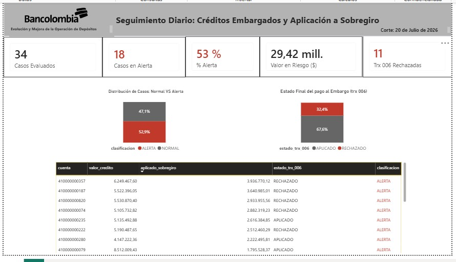

# Actividad 4 — Visualización del monitoreo

Tablero interactivo: [`Tablero_monitoreo.pbix`](Tablero_monitoreo.pbix) (abrir con Power BI Desktop).

## Indicadores principales
El tablero muestra 5 indicadores clave: **Casos Evaluados**, **Casos en Alertra**,, **%Alerta**, **Valor en Riesgo**, y **Trx 006 rechazadas** . El % de alerta es el indicador más importante para el seguimiento diario, ya que nos permite comparar el desempeño del control entre días con distinto volumen de operaciones.

## Gráficas / vistas propuestas

1. **Tarjetas de indicadores (KPI row):** 5 tarjetas — Casos Evaluados, Casos en Alerta, % de Alerta, Valor en Riesgo ($), y Trx 006 Rechazadas — para una lectura de 5 segundos del estado general del control.
2. **Barra de proporción Normal vs. Alerta:** muestra qué porcentaje de los créditos evaluados tuvo el problema de origen (aplicación a sobregiro antes que al embargo) — es la vista de "causa" del problema.
3. **Barra de proporción Aplicado vs. Rechazado (trx 006):** muestra el resultado final del pago al ente legal — es la vista de "efecto", y permite distinguir los casos en Alerta que sí se lograron cubrir de los que terminaron en rechazo real.
4. **Tabla de casos críticos (ordenada por valor aplicado a sobregiro):** el detalle operativo — cuenta, valor del crédito, valor aplicado a sobregiro, estado de la trx 006, clasificación — para que el analista de Embargos sepa exactamente qué cuentas gestionar primero, priorizadas por el monto en riesgo.

## Cómo apoya la gestión de las áreas responsables

- **Área de Embargos:** en vez de enterarse del problema cuando llega la CxC por el rechazo (días después), ve la alerta el mismo día y puede gestionar la reclasificación contable antes del cierre (Control C3 de la Actividad 2).
- **Gerencia de Depósitos:** puede monitorear si el volumen de rechazos de la trx 006 baja después de implementar la regla R2, es decir, usar el tablero como evidencia de que la solución funcional está funcionando sin haber tocado el core.
- **Auditoría / cumplimiento normativo:** la tabla de casos con su trazabilidad (usuario, fecha, valor, motivo) sirve como soporte documental ante el regulador de que el banco identifica y corrige activamente cualquier desviación de la prioridad legal del embargo.

## Nota sobre evolución diaria: 
las gráficas de proporción (puntos 2 y 3) están construidas sobre la columna clasificacion y estado_trx_006, que ya incluyen implícitamente la dimensión de fecha (fecha_credito / valor_credito) en el modelo de datos subyacente. Esto significa que el tablero está preparado para mostrar evolución diaria: si se agrega un filtro o eje de fecha, cada una de estas proporciones se puede desagregar día por día, mostrando cómo cambia el % de alerta con el tiempo. En esta entrega, la ventana de datos disponible (sobregiros.db) solo contiene créditos de este tipo para el 2026-07-20, por lo que se muestra el corte de ese único día; en producción, con datos acumulados de varios días, bastaría con agregar una gráfica de líneas o barras con la fecha en el eje X para visualizar la tendencia sin cambiar el resto del diseño.