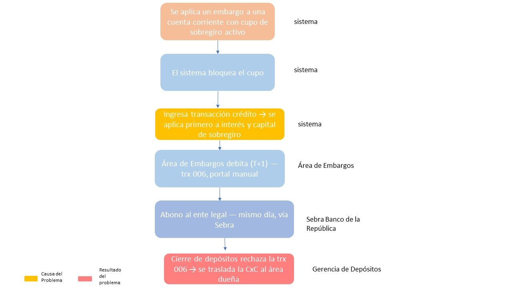

# Actividad 1 — Comprensión y análisis del problema

## 1. Diagrama del proceso actual (As-Is)

El diagrama se enfoca en el **Escenario 2** (cuenta corriente embargada y sobregirada), porque
es el flujo donde se origina el problema. Las áreas que participan son:

| Área | Rol en el proceso |
|---|---|
| Sistema / Core bancario | Detecta el embargo, bloquea saldo y cupo, aplica los abonos automáticos (interés y capital de sobregiro) |
| Área de Embargos | Ejecuta el débito manual (trx 006) al día siguiente y hace seguimiento al levantamiento de la medida |
| Sebra (Banco de la República) | Canal de giro de los recursos hacia el ente legal |
| Gerencia de Depósitos / Cierre de depósitos | Valida en el cierre diario que las transacciones estén autorizadas; rechaza la trx 006 cuando detecta uso no autorizado del cupo de sobregiro |
| Área dueña de la transacción 006 (Embargos) | Recibe el traslado contable de la CxC generada por el rechazo y debe reaplicar el movimiento o asumirlo contra su PYG |

## 2. Problema principal y riesgos

**Problema principal:** la transacción 006, que el área de Embargos usa para trasladar al ente
legal los recursos que entraron a una cuenta corriente embargada, **no está parametrizada como
una transacción autorizada para tocar el cupo de sobregiro**. Cuando el sistema, en el momento
del abono, ya aplicó parte de esos recursos a intereses y capital de sobregiro (Escenario 2), el
valor que finalmente debita la trx 006 no coincide con lo que el motor de cierre espera de una
transacción "normal" sobre saldo disponible, y el cierre de depósitos la rechaza.

Esto no es un error puntual: es un **defecto estructural de diseño**, porque dos reglas de negocio
(la prioridad del banco para recuperar su cartera de sobregiro, y la obligación legal de cubrir
el embargo) compiten por los mismos recursos, sin que exista una regla explícita que las ordene.

**Riesgos identificados:**

1. **Riesgo legal / regulatorio (el más grave):** si el banco no logra trasladar al ente legal el
 100% de los recursos que debían cubrir el embargo, incumple una orden judicial. La Superintendencia
 Financiera puede sancionar al banco, y el cliente o el ente legal pueden reclamar.
2. **Riesgo financiero / contable:** cada rechazo genera una CxC que, si el área de Embargos no
 logra reaplicarla, se convierte en un gasto contra su PYG — es decir, el banco asume una pérdida
 por una falla de diseño, no por una decisión de negocio.
3. **Riesgo operativo:** la corrección depende de un proceso manual (portal transaccional) y de la
 reacción del área de Embargos ante cada rechazo; no hay un control automático que detecte el
 problema el mismo día en que ocurre.
4. **Riesgo de trazabilidad:** hoy no existe un mecanismo sistemático que permita saber, cuenta por
 cuenta, cuánto de los recursos recibidos se aplicó a sobregiro antes que al embargo. Sin esa
 trazabilidad es difícil demostrarle al regulador (o a un juez) que el banco actuó correctamente.
5. **Riesgo reputacional:** demoras o fallas visibles en el cumplimiento de un embargo afectan la
 relación con el cliente y con las entidades judiciales.

## 3. Prioridad de aplicación de recursos cuando una cuenta embargada recibe una transacción crédito

**Recomendación: el embargo debe tener prioridad sobre el cobro de intereses y la amortización de
capital de sobregiro.**

Justificación:

- **Jerárquica/legal:** un embargo judicial es una orden de una autoridad competente que inmoviliza
 recursos para un tercero. El cupo de sobregiro es un producto **contractual entre el banco y el
 cliente**, y una obligación contractual no puede tener prelación sobre una orden judicial. Cobrarse
 primero como acreedor (vía sobregiro) antes de atender la orden judicial expone al banco a actuar
 como si estuviera "compensando" recursos embargables, lo cual contradice el espíritu de la medida
 de embargo y el límite de inembargabilidad que la norma busca proteger para el cliente.
- **Buenas prácticas / riesgo reputacional:** priorizar el interés propio del banco (recuperar cartera)
 por encima de una obligación legal del cliente es difícil de justificar ante el regulador o ante un
 juez, incluso si contablemente es conveniente para el banco.
- **Consistencia con el proceso de cuentas de ahorro:** en cuentas de ahorro, el 100% del recurso
 recibido se bloquea y se traslada al embargo, sin que exista una figura de cobro previo. Aplicar un
 estándar distinto en cuenta corriente (dejar que el sobregiro se cobre primero) crea una inconsistencia
 difícil de sostener como política de banco.

**Matiz operativo:** esto no significa que el banco renuncie a cobrar el sobregiro. Significa que el
**orden de aplicación** debe ser: 1) cubrir el embargo hasta el monto exigido, 2) sólo si sobra saldo
después de cubrir el embargo, aplicarlo a intereses/capital de sobregiro. La propuesta funcional de la
Actividad 2 desarrolla cómo lograr esto sin necesitar los 3 años de desarrollo técnico que pidió Embargos.
