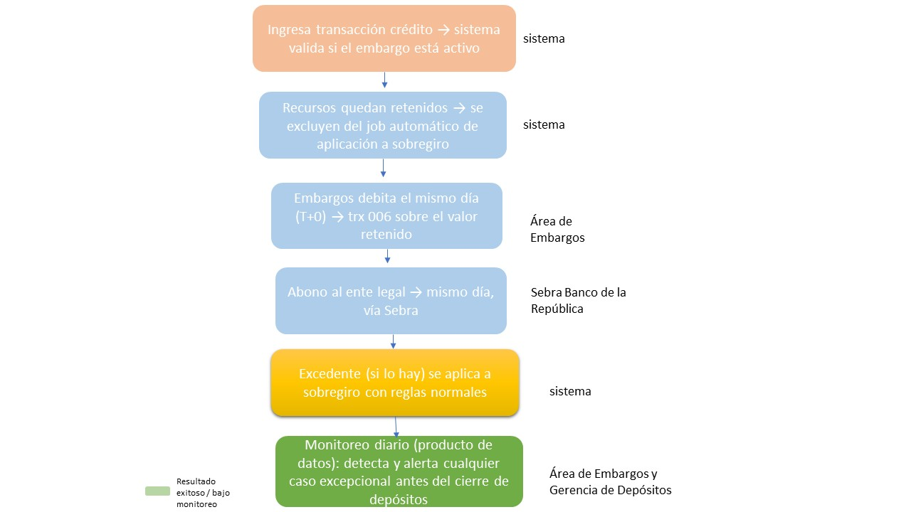

# Actividad 2 — Diseño funcional de la solución (To-Be)

## Idea central

Embargos pidió una solución que toca el **core del cierre de depósitos** (autorizar la trx 006
para usar cupo de sobregiro), y eso tarda ~3 años. La propuesta de esta actividad **no toca el
motor de cierre**: cambia el **momento y la regla de aplicación** de los recursos antes de que
lleguen a ese motor, usando parametrización y un control de monitoreo. Esto es lo que la hace
viable en 4 meses.

## Diagrama del proceso propuesto (To-Be)

Comparado con el As-Is, el cambio clave está en el orden: el sistema ya no aplica automáticamente
el abono a intereses/capital de sobregiro antes de que Embargos pueda actuar. En su lugar, el
recurso queda retenido a favor del embargo, y solo el excedente (si lo hay) se libera a sobregiro.

## Reglas de negocio

| # | Regla |
|---|---|
| R1 | Prioridad de aplicación de recursos: **1) Embargo vigente, 2) Interés de sobregiro, 3) Capital de sobregiro, 4) Disponible del cliente.** |
| R2 | Mientras una cuenta corriente tenga un embargo vigente con saldo pendiente por cubrir, cualquier transacción crédito que reciba se marca como **retenida** y se excluye del job automático de aplicación a sobregiro. |
| R3 | El área de Embargos ejecuta el débito (trx 006) **el mismo día (T+0)** que ingresan los recursos retenidos, por el valor pendiente del embargo, eliminando la ventana donde hoy se aplica automáticamente al sobregiro. |
| R4 | Si el abono supera el valor pendiente del embargo, el excedente se libera y se aplica a intereses/capital de sobregiro con las reglas normales del producto. |
| R5 | Se ejecuta un control diario automatizado (el producto de datos de la Actividad 3) que identifica cualquier cuenta donde, por excepción, se haya aplicado a sobregiro antes que al embargo. |
| R6 | Toda reclasificación contable manual derivada de una alerta debe quedar documentada (usuario, cuenta, valor, fecha, motivo) para trazabilidad ante auditoría o el regulador. |

## Controles

- **C1 — Validación en el momento del abono:** si la cuenta tiene un embargo activo, el crédito
 se excluye del proceso automático de aplicación a sobregiro (parametrización, no desarrollo pesado).
- **C2 — Conciliación diaria:** el producto de datos de la Actividad 3 cruza movimientos crédito vs.
 aplicación a embargo/sobregiro y clasifica cada cuenta en Normal o Alerta.
- **C3 — Segregación de funciones:** cualquier reclasificación contable manual requiere aprobación
 de un segundo responsable (no la misma persona que detecta y corrige).
- **C4 — Alertamiento:** notificación automática a Embargos y a la Gerencia de Depósitos cuando el
 monitoreo detecta un caso de alerta, para gestionarlo antes del cierre del día.

## Excepciones

- **E1 — Embargos concurrentes:** si una cuenta tiene más de un embargo vigente, los recursos se
 aplican en el orden de radicado (el más antiguo primero), documentando el criterio usado.
- **E2 — Abono insuficiente:** si el crédito recibido no alcanza a cubrir ni el valor mínimo de
 gestión, se retiene el 100% igualmente y se acumula para el siguiente movimiento.
- **E3 — Timing embargo/abono el mismo día:** si el embargo se radica el mismo día que llega un
 crédito y el job automático ya corrió, el caso se marca como Alerta y se resuelve por reclasificación
 manual bajo el control C3, no se considera incumplimiento sino una excepción operativa documentada.
- **E4 — Excedente tras cubrir el embargo total:** una vez el embargo queda cubierto en su totalidad,
 el remanente del abono (si existe) se libera de inmediato y la cuenta puede operar con normalidad,
 incluido el cupo de sobregiro (según ya contempla el proceso vigente).

## Por qué esto es viable en 4 meses (y no 3 años)

La solución de fondo que pidió Embargos requiere modificar el motor del cierre de depósitos
(cambiar qué transacciones están autorizadas a tocar sobregiro), lo cual implica un cambio de
core con todas sus pruebas regulatorias. La propuesta aquí evita ese cambio: actúa **antes** del
cierre, con una regla de exclusión parametrizable (similar a un flag por cuenta) y un control de
monitoreo construido como producto de datos independiente (Actividad 3), no como un cambio al
sistema transaccional central.
